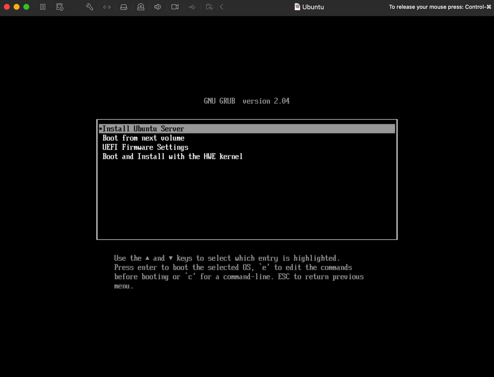
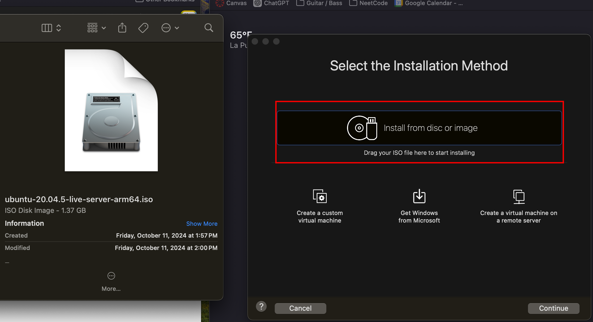
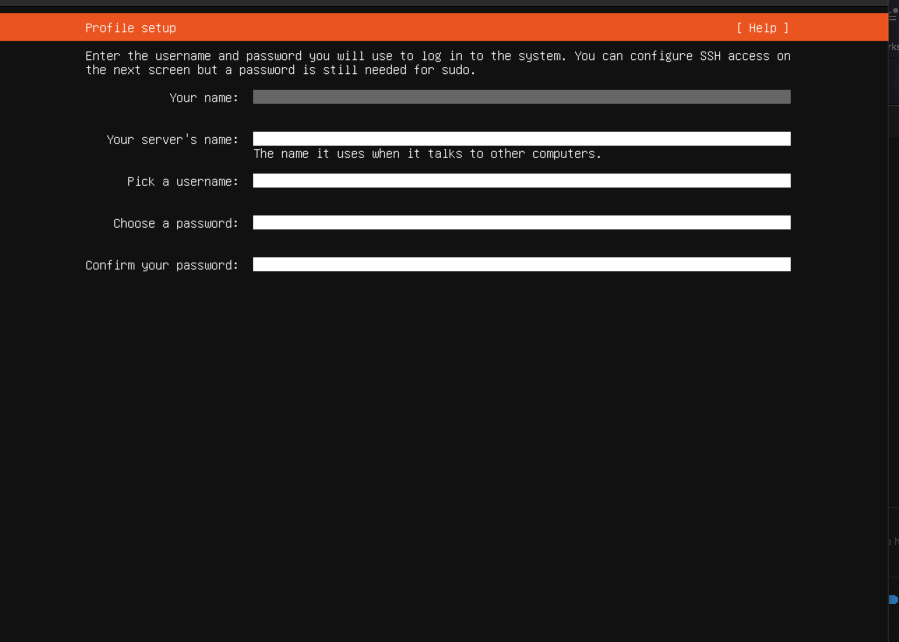

# CPP EVTOL Autonomy (Apple Silicon Devices)

## Virtual Environment Setup
Download and install VMware Fusion from : [VMware 13.6.1 Download](https://support.broadcom.com/group/ecx/productfiles?subFamily=VMware%20Fusion&displayGroup=VMware%20Fusion%2013%20Pro%20for%20Personal%20Use&release=13.6.1&os=&servicePk=524470&language=EN)
Download Ubuntu 20.04.5 Server from: [Ubuntu 20.0.4.5 Live Server ](https://cdimage.ubuntu.com/releases/20.04/release/ubuntu-20.04.5-live-server-arm64.iso)

Click  "Install Ubuntu Server": 

Open VMware Fusion and drag Ubuntu ISO file here: 

Enter Credentials *(This will be the information you enter to login to the Desktop)*:

Once Installed and Rebooted enter these commands in the terminal: 

    sudo apt update
    sudo apt install ubuntu-desktop
    sudo reboot

Log in to terminal using your credentials.  Open terminal and ensure release is 20.04 using command: 

    lsb_release -a

**Note:** Do **NOT** upgrade Ubuntu version if prompted

## PX4 Setup

In the terminal, install git using:

    sudo apt install git -y

Then to clone and install dependencies of PX4 Enter: 

    cd Desktop 

    git clone https://github.com/PX4/PX4-Autopilot.git --recursive

    bash ./PX4-Autopilot/Tools/setup/ubuntu.sh

Then reboot your system:

    sudo reboot

## Installing QGroundControl with Flatpak
Instructions on Installing QGroundControl from [this repository](https://github.com/sidharthmohannair/Installing-QGroundControl-on-Ubuntu-ARM64-using-Flatpak)
### Step 1: Installing Flatpak
Install Flatpak 1.12.4 using these commands: 

    sudo add-apt-repository ppa:alexlarsson/flatpak
    sudo apt update
    sudo apt install flatpak

### Step 2: Add Flathub and thopiekar Repositories
Add the following repositories by running the two commands: 

    flatpak remote-add --if-not-exists flathub https://flathub.org/repo/flathub.flatpakrepo
    
    flatpak remote-add --if-not-exists thopiekar.eu https://dl.thopiekar.eu/flatpak/_.flatpakrepo

### Step 3: Install and run  QGroundControl
Install QGroundControl using the following commands:

    flatpak install flathub org.kde.Platform/aarch64/5.15-21.08
    
    flatpak install thopiekar.eu org.mavlink.qgroundcontrol
Then run QGroundControl using the following command:

    flatpak run --device=all org.mavlink.qgroundcontrol

